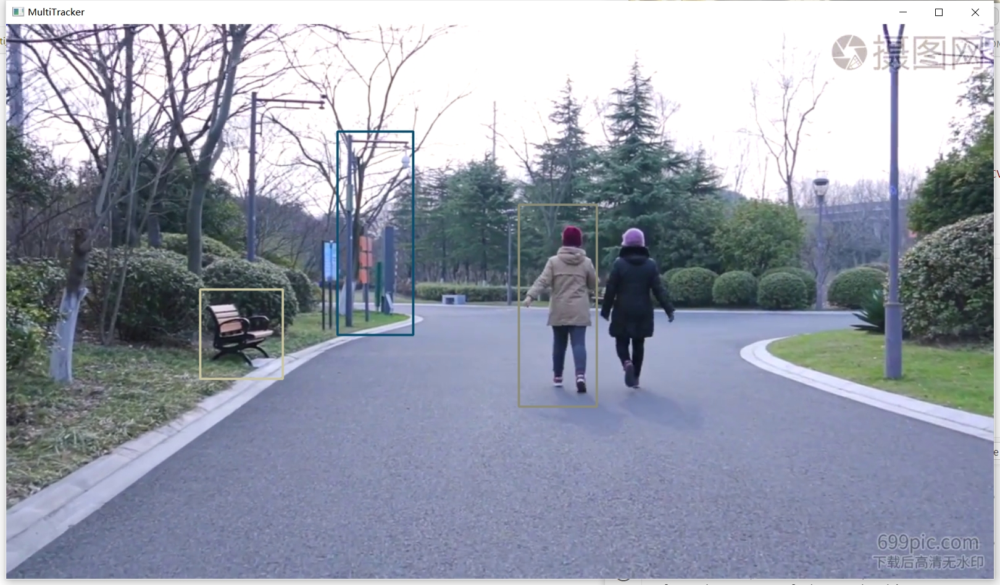

# Machine/Deep Learning for Multi Object Tracking

**ML: Machine Learning**
**DL: Deep Learning**

---

This repository contains all extendable code to support the function of multi object tracking

---

## Data and Network Parameters
**Test Data:** folder: ./videos (.mp4/.avi)

---

## Project Setup
### 1. Requirements:
Win 10 + VSCode

cuda 11.1.0  
OpenCV + Python 3.9.13  
([dlib-bin 19.24.2.post1](https://files.pythonhosted.org/packages/b5/87/8b8c506e018c3e6b152bf7080401f84c36e3e28d36982024e5754668e003/dlib_bin-19.24.2.post1-cp39-cp39-win_amd64.whl))  
numpy 1.26.0  

### 2. Create the project folder structure after specifying the root folder

### 3. Open the project folder though VSCode

### 4. Run Code *mainw.py*
**Run with ML algorithms:** 
    - Tracker Type Selector: select ML Track algorithm (default: CSRT)  
    - Video File Selector: select test video  
    
    - Confirm button  
    - Run:   
        (1) SELECT:    press "SPACE" to select ROI  
        (2) PLAY:      then press "SPACE" or "ENTER" button to continue to play video  
        (3) EXIT:      press "ESC" or close windows  
    - Result:  
    

**Run with DL algorithms:**
    - Tracker Type Selector: select "Deep Learning"  
    - Configuration:   
        - Target Object: select some objects you want to track  
        - Confidence: select confidence value (default: 0.3)(eg: "car")  
    - Video File Selector: select test video  
    
    - Confirm button  
    - Result:  
    

---

## Updates - to do list:
1. (*mian.py*) Input: can be expanded: could select the real-time video stream of the camera as the input  
2. (*mot_OpenCV.py*) Select ROI: The initial state is set to pause, and to select ROI at the begining  
3. (*mot_DL.py*) Detect Object: set up intermittent detection (e.g. detect objects and update trackers per 20 frames)  
4. (*mot_DL.py*) Increase speed: include DL detection targets process in multiple processes  
5. Output: Implement new video output function  

---

## Algorithms Introduction (multi object tracking)

### ML algorithms 

#### BOOSTING
Principle: Based on the online version of AdaBoost, the HAAR feature is used for classification.  
Features: Slower speed, average accuracy, not suitable for modern high-performance tracking needs.  

#### CSRT (Correlation Filter Response Tracker) --> Recommended
Principle: Combines traditional correlation filters and deep learning technology to improve the accuracy of tracking.  
Features: More accurate than KCF, but relatively slow, suitable for scenarios that require high accuracy.  

#### KCF (Kernelized Correlation Filters) --> Recommended
Principle: Optimize the correlation filter using cyclic matrices and kernel techniques to improve speed and accuracy.  
Features: The ability to deal with occlusion is good and fast, which is a common choice in modern tracking algorithms.  

#### MEDIANFLOW
Principle: Tracking is performed by analyzing the trajectory of the target in successive frames, which is suitable for scenarios with predictable motion.  
Characteristics: Sensitive to rapid movements and shape changes, may fail in some cases.  

#### MIL (Multiple Instance Learning)
Principle: Combining the ideas of online learning and multi-instance learning, the classifier is trained using multiple candidate windows.  
FEATURES: AN IMPROVEMENT OVER BOOSTING, BUT THERE IS STILL A RISK OF TRACKING FAILURE.  

#### MOSSE (Minimum Output Sum of Squared Error)
Principle: A fast single-channel correlation filter tracking algorithm for real-time applications.  
Features: Very fast, but relatively low accuracy.  

#### TLD (Tracking-Learning-Detection)
Principle: combining the three processes of tracking, learning, and detection, and able to handle long-term tracking and complex scenarios.  
Features: Performs best with multi-frame occlusion, but can produce more false positives.  

#### GOTURN
Principle: A tracking algorithm based on Convolutional Neural Network (CNN) that uses a pre-trained model for fast online tracking.  
Features: Strong robustness to viewpoint changes, lighting changes, and distortions, but limited ability to handle occlusion.  

### DL algorithms --> Recommended
**model:** SSD（Single Shot MultiBox Detector）--> for object detect  
**model structure description file:** MobileNetSSD_deploy.prototxt  
**trained model weight file:** MobileNetSSD_deploy.caffemodel  
**net framework:** Caffe  
